# Financial Sentiment Analysis — Financial PhraseBank

## Overview

This project performs sentiment classification on the Financial PhraseBank dataset, classifying financial sentences into three categories: **Negative (0)**, **Neutral (1)**, and **Positive (2)**.

Four subsets of the dataset are evaluated, differing by annotator agreement threshold. Two embedding models are compared across five classifiers on each subset.

---

## Pipeline

```
Raw Data → Class Balancing → Embedding Extraction → Classification → Evaluation
```

1. **Data Loading** — Financial PhraseBank `.txt` files, parsed and label-mapped
2. **Class Balancing** — Training set only: random oversampling of minority classes (Negative, Positive) to match Neutral count; all classifiers use `class_weight='balanced'`
3. **Embedding** — Sentences encoded into dense vectors via pre-trained transformer models
4. **Classification** — Five classifiers trained and evaluated on a fixed 80/20 train/test split
5. **Evaluation** — Accuracy, precision, recall, F1-score per class, confusion matrices

> **Note:** Oversampling is applied **after** the train/test split to prevent data leakage. The test set always reflects the original class distribution.

---

## Models

| | all-MiniLM-L6-v2 | FinBERT (ProsusAI/finbert) |
|---|---|---|
| Type | General-purpose | Financial domain |
| Embedding dim | 384 | 768 |
| Representation | Mean pooling | [CLS] token |

---

## Datasets

| Dataset | Total Samples | Negative | Neutral | Positive |
|---|---|---|---|---|
| All Agree | 2,264 | 303 (13.4%) | 1,391 (61.4%) | 570 (25.2%) |
| 75% Agree | 3,453 | 420 (12.2%) | 2,146 (62.1%) | 887 (25.7%) |
| 66% Agree | 4,217 | 514 (12.2%) | 2,535 (60.1%) | 1,168 (27.7%) |
| 50% Agree | 4,846 | 604 (12.5%) | 2,879 (59.4%) | 1,363 (28.1%) |

---

## Overall Results Summary

### MiniLM

| Classifier | All Agree | 75% Agree | 66% Agree | 50% Agree |
|---|---|---|---|---|
| Logistic Regression | 88.74% | 83.07% | 79.62% | 75.36% |
| Linear SVM | **90.29%** | 83.65% | 79.27% | 75.15% |
| RBF SVM | **90.29%** | **87.70%** | **83.06%** | **78.87%** |
| Random Forest | 85.65% | 81.33% | 73.22% | 74.02% |
| Naive Bayes | 81.68% | 73.95% | 68.84% | 66.39% |

### FinBERT

| Classifier | All Agree | 75% Agree | 66% Agree | 50% Agree |
|---|---|---|---|---|
| Logistic Regression | 98.90% | 96.53% | 91.23% | 89.59% |
| Linear SVM | **99.34%** | 95.95% | 90.05% | 87.63% |
| RBF SVM | 98.90% | **96.67%** | 92.77% | 88.97% |
| Random Forest | 98.90% | **96.67%** | **93.01%** | **89.69%** |
| Naive Bayes | 99.12% | 96.38% | 92.77% | 88.66% |

---

## Class Centroid Distances (Embedding Space)

| Dataset | Model | Neg vs Neu | Neg vs Pos | Neu vs Pos |
|---|---|---|---|---|
| All Agree | MiniLM | 0.4759 | 0.2852 | 0.3560 |
| All Agree | FinBERT | 24.7072 | 23.5156 | 20.7731 |
| 75% Agree | MiniLM | 0.4237 | 0.2901 | 0.2601 |
| 75% Agree | FinBERT | 23.7244 | 23.3503 | 18.1715 |
| 66% Agree | MiniLM | 0.3741 | 0.2895 | 0.2054 |
| 66% Agree | FinBERT | 22.8957 | 23.3193 | 16.1852 |
| 50% Agree | MiniLM | 0.3489 | 0.2853 | 0.1785 |
| 50% Agree | FinBERT | 22.3004 | 23.0993 | 14.7299 |

---

---

# All Agree Dataset

## Data Analysis

| Label Distribution | Sentence Length |
|---|---|
|  |  |

### MiniLM Visualisation

| PCA | t-SNE |
|---|---|
| 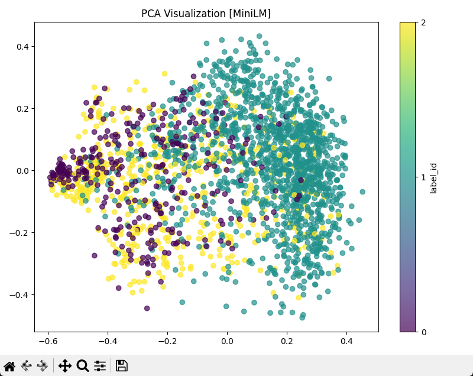 | 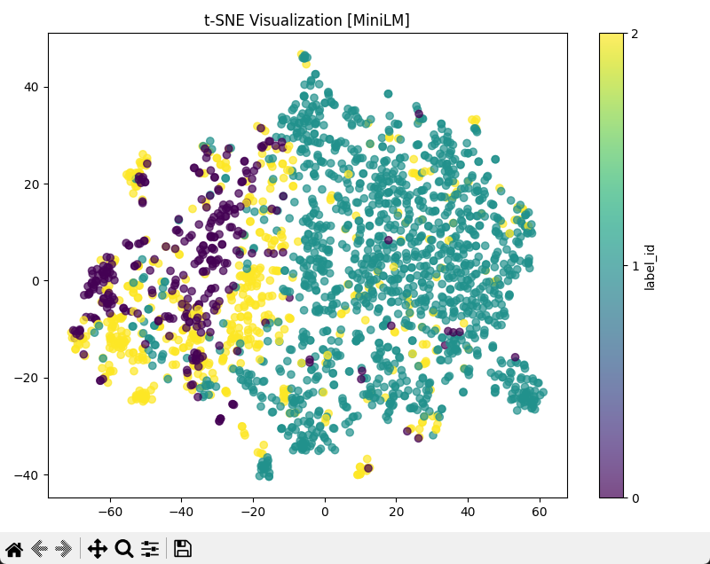 |

### FinBERT Visualisation

| PCA | t-SNE |
|---|---|
| 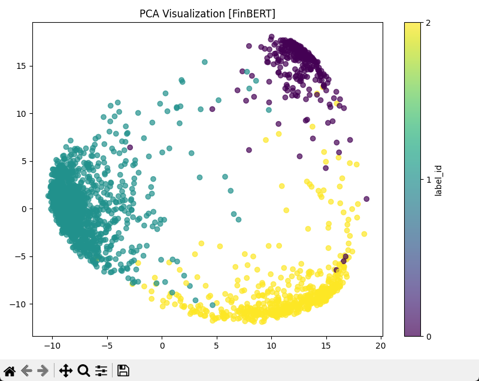 | 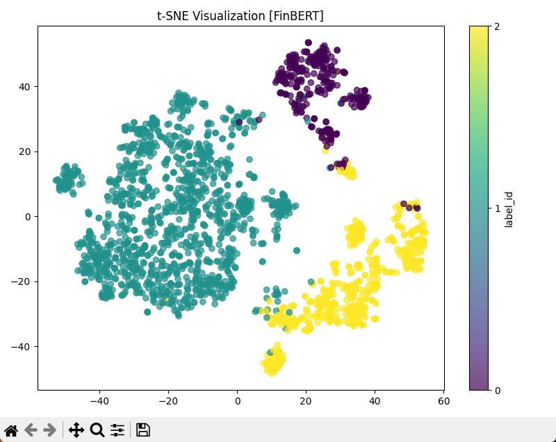 |

## MiniLM — Classifier Results

| Classifier | Accuracy |
|---|---|
| Logistic Regression | 88.74% |
| **Linear SVM** | **90.29%** |
| **RBF SVM** | **90.29%** |
| Random Forest | 85.65% |
| Naive Bayes | 81.68% |

| LR | Linear SVM |
|---|---|
|  |  |

| RBF SVM | Random Forest |
|---|---|
|  | 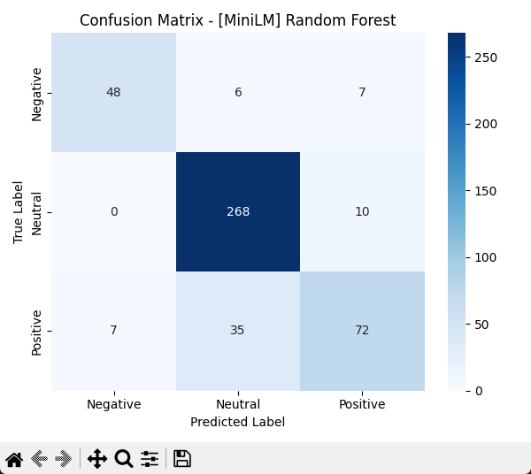 |

| Naive Bayes |
|---|
| 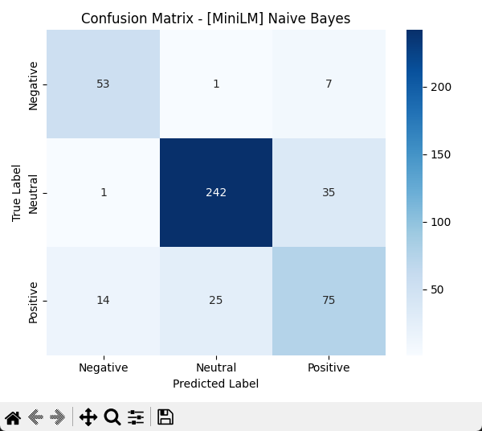 |

```
                     precision  recall  f1-score  support

Logistic Regression
  Negative (0)          0.80    0.92      0.85       61
  Neutral  (1)          0.96    0.91      0.94      278
  Positive (2)          0.77    0.81      0.79      114
  macro avg             0.85    0.88      0.86      453

Linear SVM
  Negative (0)          0.81    0.92      0.86       61
  Neutral  (1)          0.97    0.93      0.95      278
  Positive (2)          0.81    0.82      0.82      114
  macro avg             0.86    0.89      0.88      453

RBF SVM
  Negative (0)          0.89    0.79      0.83       61
  Neutral  (1)          0.93    0.97      0.95      278
  Positive (2)          0.83    0.80      0.81      114
  macro avg             0.88    0.85      0.87      453

Random Forest
  Negative (0)          0.87    0.79      0.83       61
  Neutral  (1)          0.87    0.96      0.91      278
  Positive (2)          0.81    0.63      0.71      114
  macro avg             0.85    0.79      0.82      453

Naive Bayes
  Negative (0)          0.78    0.87      0.82       61
  Neutral  (1)          0.90    0.87      0.89      278
  Positive (2)          0.64    0.66      0.65      114
  macro avg             0.77    0.80      0.79      453
```

## FinBERT — Classifier Results

| Classifier | Accuracy |
|---|---|
| Logistic Regression | 98.90% |
| **Linear SVM** | **99.34%** |
| RBF SVM | 98.90% |
| Random Forest | 98.90% |
| Naive Bayes | 99.12% |

| LR | Linear SVM |
|---|---|
|  |  |

| RBF SVM | Random Forest |
|---|---|
|  |  |

| Naive Bayes |
|---|
|  |

```
                     precision  recall  f1-score  support

Logistic Regression
  Negative (0)          0.98    0.97      0.98       61
  Neutral  (1)          1.00    0.99      1.00      278
  Positive (2)          0.97    0.99      0.98      114
  macro avg             0.98    0.98      0.98      453

Linear SVM
  Negative (0)          0.98    0.98      0.98       61
  Neutral  (1)          1.00    1.00      1.00      278
  Positive (2)          0.98    0.99      0.99      114
  macro avg             0.99    0.99      0.99      453

RBF SVM
  Negative (0)          0.98    0.97      0.98       61
  Neutral  (1)          1.00    0.99      1.00      278
  Positive (2)          0.97    0.99      0.98      114
  macro avg             0.98    0.98      0.98      453

Random Forest
  Negative (0)          0.98    0.97      0.98       61
  Neutral  (1)          1.00    0.99      1.00      278
  Positive (2)          0.97    0.99      0.98      114
  macro avg             0.98    0.98      0.98      453

Naive Bayes
  Negative (0)          0.98    0.97      0.98       61
  Neutral  (1)          1.00    1.00      1.00      278
  Positive (2)          0.97    0.99      0.98      114
  macro avg             0.99    0.98      0.99      453
```

---

---

# 75% Agree Dataset

## Data Analysis

| Label Distribution | Sentence Length |
|---|---|
| 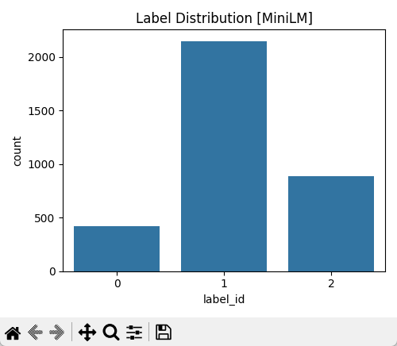 | 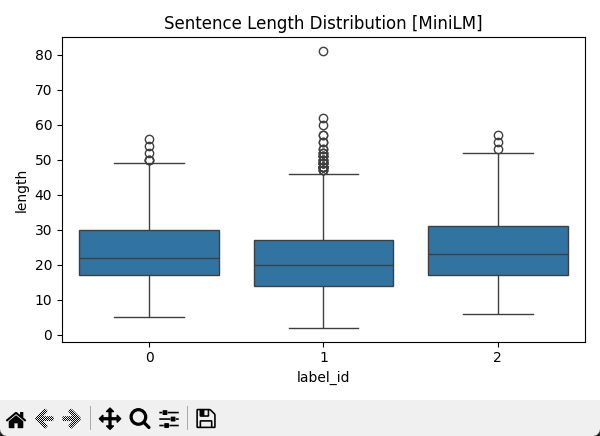 |

### MiniLM Visualisation

| PCA | t-SNE |
|---|---|
| 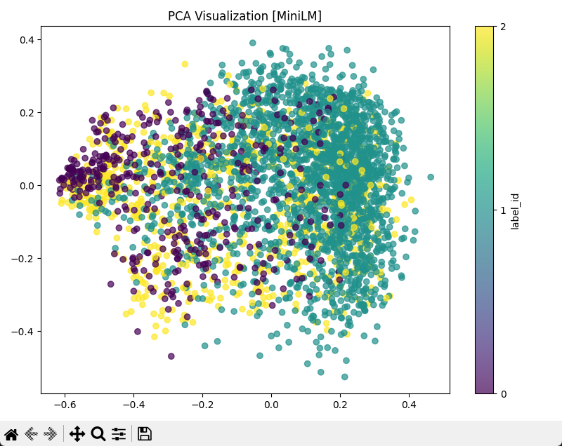 | 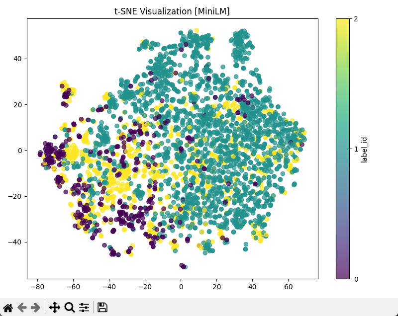 |

### FinBERT Visualisation

| PCA | t-SNE |
|---|---|
| 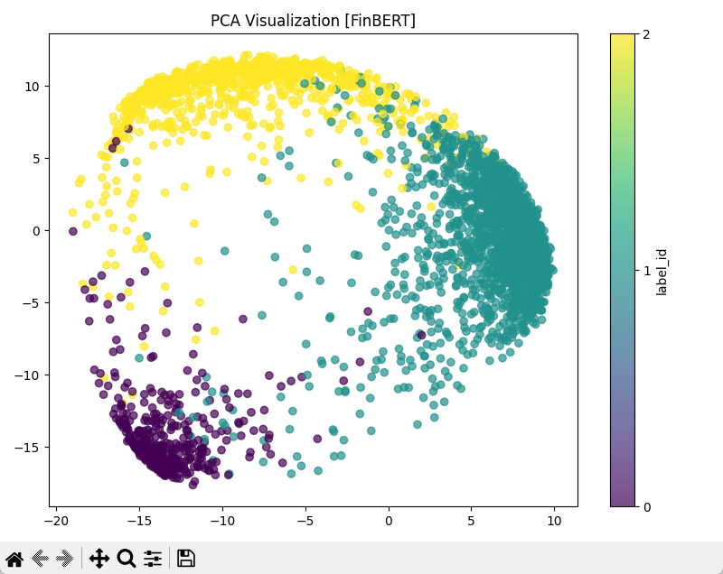 | 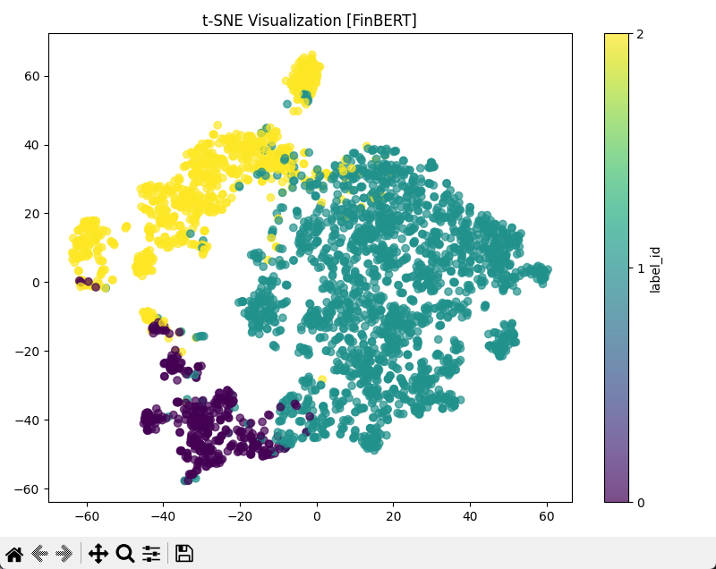 |

## MiniLM — Classifier Results

| Classifier | Accuracy |
|---|---|
| Logistic Regression | 83.07% |
| Linear SVM | 83.65% |
| **RBF SVM** | **87.70%** |
| Random Forest | 81.33% |
| Naive Bayes | 73.95% |

| LR | Linear SVM |
|---|---|
| 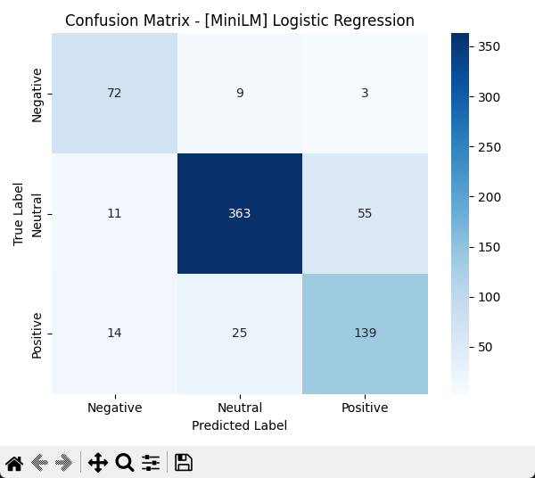 |  |

| RBF SVM | Random Forest |
|---|---|
| 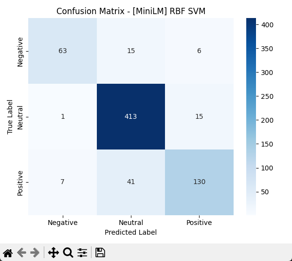 | 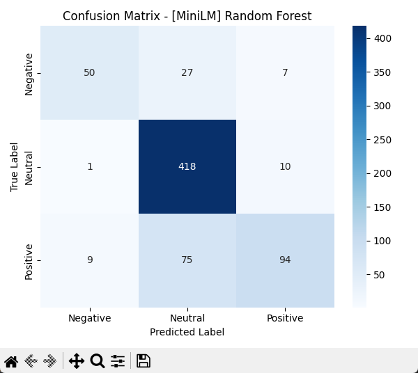 |

| Naive Bayes |
|---|
| 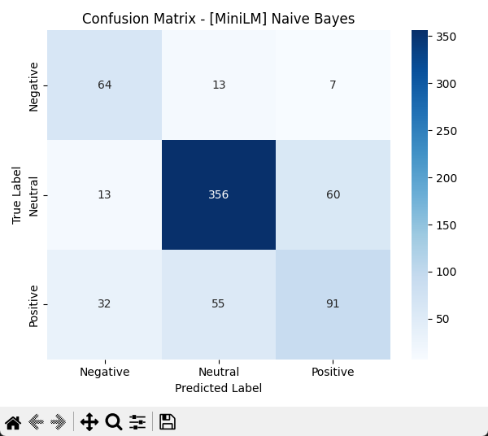 |

```
                     precision  recall  f1-score  support

Logistic Regression
  Negative (0)          0.74    0.86      0.80       84
  Neutral  (1)          0.91    0.85      0.88      429
  Positive (2)          0.71    0.78      0.74      178
  macro avg             0.79    0.83      0.81      691

Linear SVM
  Negative (0)          0.72    0.87      0.79       84
  Neutral  (1)          0.92    0.85      0.88      429
  Positive (2)          0.73    0.79      0.76      178
  macro avg             0.79    0.84      0.81      691

RBF SVM
  Negative (0)          0.89    0.75      0.81       84
  Neutral  (1)          0.88    0.96      0.92      429
  Positive (2)          0.86    0.73      0.79      178
  macro avg             0.88    0.81      0.84      691

Random Forest
  Negative (0)          0.83    0.60      0.69       84
  Neutral  (1)          0.80    0.97      0.88      429
  Positive (2)          0.85    0.53      0.65      178
  macro avg             0.83    0.70      0.74      691

Naive Bayes
  Negative (0)          0.59    0.76      0.66       84
  Neutral  (1)          0.84    0.83      0.83      429
  Positive (2)          0.58    0.51      0.54      178
  macro avg             0.67    0.70      0.68      691
```

## FinBERT — Classifier Results

| Classifier | Accuracy |
|---|---|
| Logistic Regression | 96.53% |
| Linear SVM | 95.95% |
| **RBF SVM** | **96.67%** |
| **Random Forest** | **96.67%** |
| Naive Bayes | 96.38% |

| LR | Linear SVM |
|---|---|
| 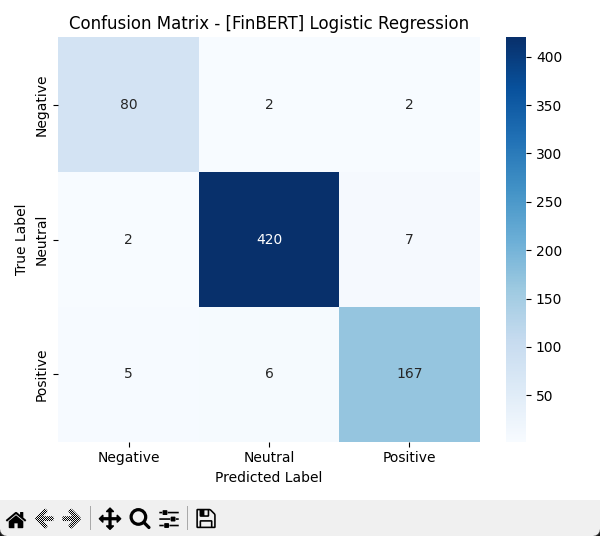 |  |

| RBF SVM | Random Forest |
|---|---|
|  |  |

| Naive Bayes |
|---|
|  |

```
                     precision  recall  f1-score  support

Logistic Regression
  Negative (0)          0.92    0.95      0.94       84
  Neutral  (1)          0.98    0.98      0.98      429
  Positive (2)          0.95    0.94      0.94      178
  macro avg             0.95    0.96      0.95      691

Linear SVM
  Negative (0)          0.93    0.93      0.93       84
  Neutral  (1)          0.98    0.97      0.97      429
  Positive (2)          0.93    0.94      0.94      178
  macro avg             0.95    0.95      0.95      691

RBF SVM
  Negative (0)          0.94    0.95      0.95       84
  Neutral  (1)          0.98    0.98      0.98      429
  Positive (2)          0.94    0.95      0.95      178
  macro avg             0.96    0.96      0.96      691

Random Forest
  Negative (0)          0.95    0.96      0.96       84
  Neutral  (1)          0.97    0.98      0.98      429
  Positive (2)          0.95    0.93      0.94      178
  macro avg             0.96    0.96      0.96      691

Naive Bayes
  Negative (0)          0.93    0.96      0.95       84
  Neutral  (1)          0.98    0.98      0.98      429
  Positive (2)          0.95    0.93      0.94      178
  macro avg             0.95    0.96      0.95      691
```

---

---

# 66% Agree Dataset

## Data Analysis

| Label Distribution | Sentence Length |
|---|---|
|  |  |

### MiniLM Visualisation

| PCA | t-SNE |
|---|---|
| 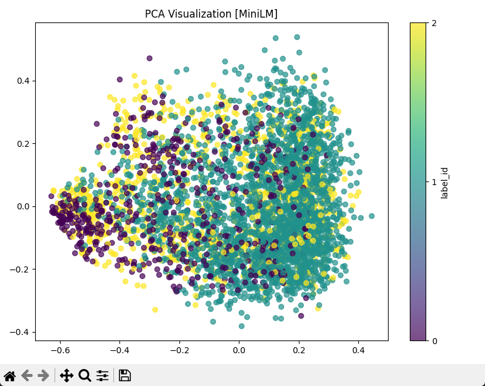 | 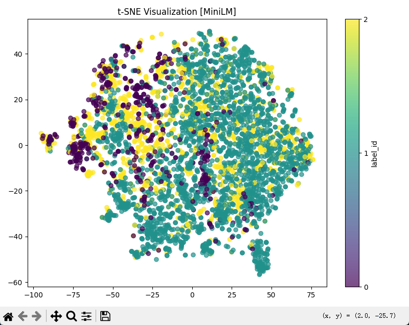 |

### FinBERT Visualisation

| PCA | t-SNE |
|---|---|
| 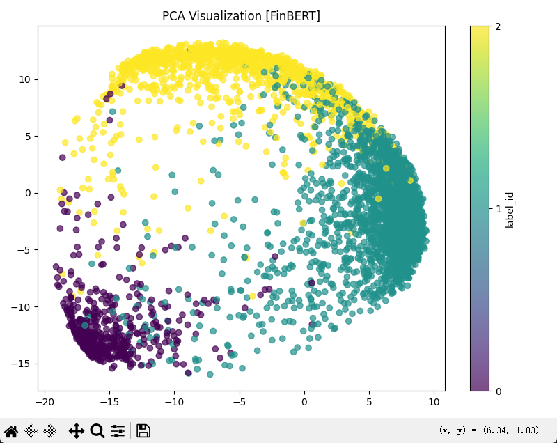 | 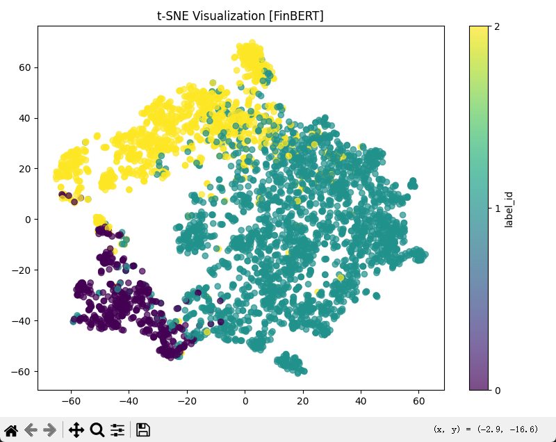 |

## MiniLM — Classifier Results

| Classifier | Accuracy |
|---|---|
| Logistic Regression | 79.62% |
| Linear SVM | 79.27% |
| **RBF SVM** | **83.06%** |
| Random Forest | 73.22% |
| Naive Bayes | 68.84% |

| LR | Linear SVM |
|---|---|
|  |  |

| RBF SVM | Random Forest |
|---|---|
|  | 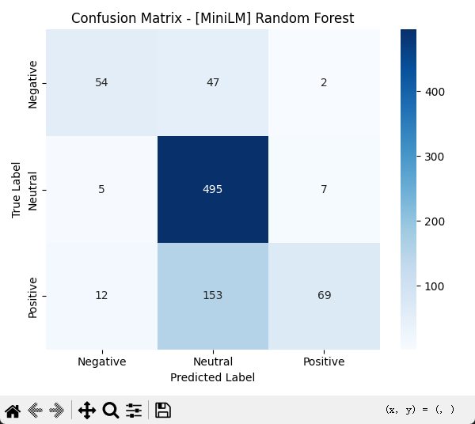 |

| Naive Bayes |
|---|
| 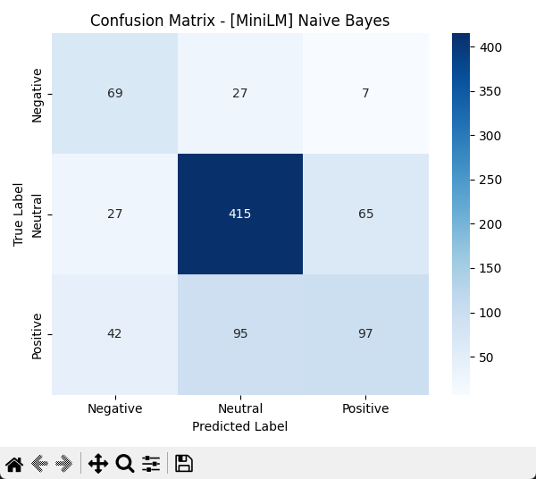 |

```
                     precision  recall  f1-score  support

Logistic Regression
  Negative (0)          0.64    0.86      0.74      103
  Neutral  (1)          0.90    0.81      0.85      507
  Positive (2)          0.69    0.74      0.72      234
  macro avg             0.74    0.80      0.77      844

Linear SVM
  Negative (0)          0.63    0.85      0.73      103
  Neutral  (1)          0.89    0.81      0.85      507
  Positive (2)          0.70    0.73      0.71      234
  macro avg             0.74    0.80      0.76      844

RBF SVM
  Negative (0)          0.79    0.75      0.77      103
  Neutral  (1)          0.84    0.94      0.88      507
  Positive (2)          0.83    0.64      0.72      234
  macro avg             0.82    0.77      0.79      844

Random Forest
  Negative (0)          0.76    0.52      0.62      103
  Neutral  (1)          0.71    0.98      0.82      507
  Positive (2)          0.88    0.29      0.44      234
  macro avg             0.79    0.60      0.63      844

Naive Bayes
  Negative (0)          0.50    0.67      0.57      103
  Neutral  (1)          0.77    0.82      0.80      507
  Positive (2)          0.57    0.41      0.48      234
  macro avg             0.62    0.63      0.62      844
```

## FinBERT — Classifier Results

| Classifier | Accuracy |
|---|---|
| Logistic Regression | 91.23% |
| Linear SVM | 90.05% |
| RBF SVM | 92.77% |
| **Random Forest** | **93.01%** |
| Naive Bayes | 92.77% |

| LR | Linear SVM |
|---|---|
| 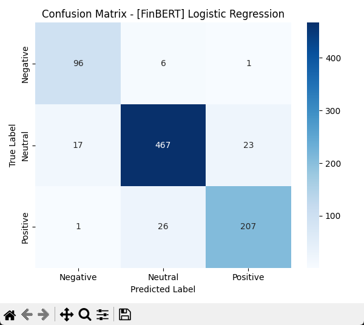 |  |

| RBF SVM | Random Forest |
|---|---|
|  |  |

| Naive Bayes |
|---|
| 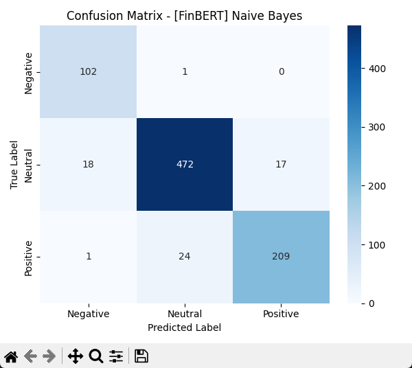 |

```
                     precision  recall  f1-score  support

Logistic Regression
  Negative (0)          0.84    0.93      0.88      103
  Neutral  (1)          0.94    0.92      0.93      507
  Positive (2)          0.90    0.88      0.89      234
  macro avg             0.89    0.91      0.90      844

Linear SVM
  Negative (0)          0.85    0.93      0.89      103
  Neutral  (1)          0.92    0.92      0.92      507
  Positive (2)          0.88    0.85      0.87      234
  macro avg             0.88    0.90      0.89      844

RBF SVM
  Negative (0)          0.85    0.96      0.90      103
  Neutral  (1)          0.96    0.93      0.94      507
  Positive (2)          0.91    0.92      0.91      234
  macro avg             0.90    0.94      0.92      844

Random Forest
  Negative (0)          0.86    0.96      0.91      103
  Neutral  (1)          0.94    0.94      0.94      507
  Positive (2)          0.93    0.89      0.91      234
  macro avg             0.91    0.93      0.92      844

Naive Bayes
  Negative (0)          0.84    0.99      0.91      103
  Neutral  (1)          0.95    0.93      0.94      507
  Positive (2)          0.92    0.89      0.91      234
  macro avg             0.91    0.94      0.92      844
```

---

---

# 50% Agree Dataset

## Data Analysis

| Label Distribution | Sentence Length |
|---|---|
|  |  |

### MiniLM Visualisation

| PCA | t-SNE |
|---|---|
| 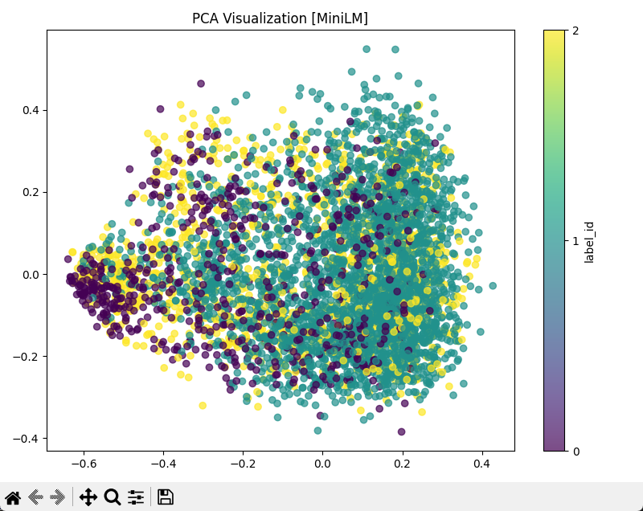 | 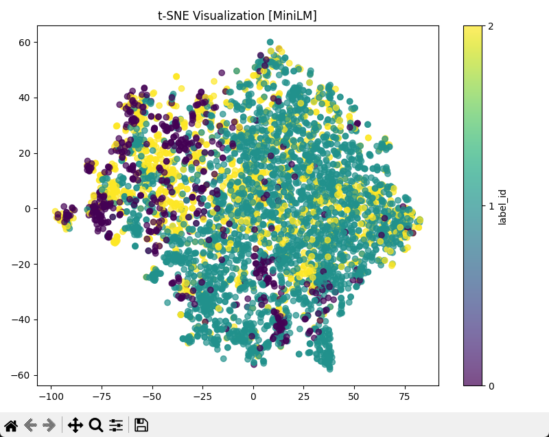 |

### FinBERT Visualisation

| PCA | t-SNE |
|---|---|
| 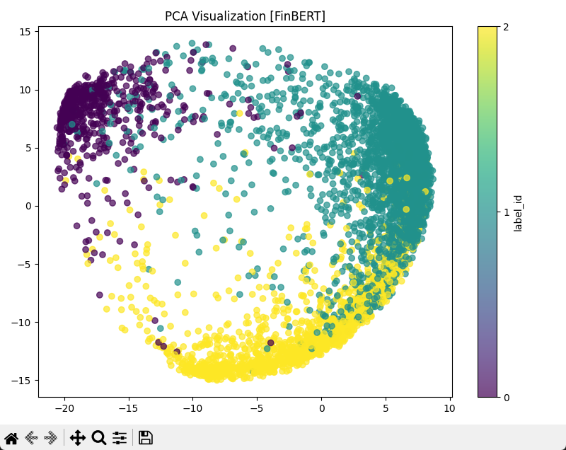 | 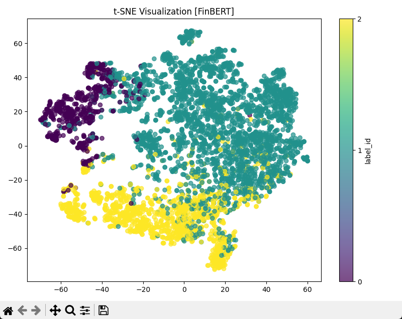 |

## MiniLM — Classifier Results

| Classifier | Accuracy |
|---|---|
| Logistic Regression | 75.36% |
| Linear SVM | 75.15% |
| **RBF SVM** | **78.87%** |
| Random Forest | 74.02% |
| Naive Bayes | 66.39% |

| LR | Linear SVM |
|---|---|
|  |  |

| RBF SVM | Random Forest |
|---|---|
|  | 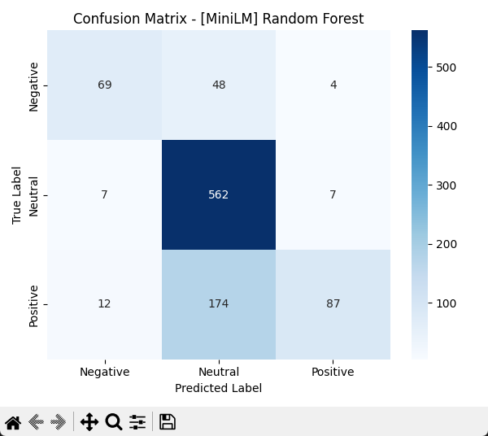 |

| Naive Bayes |
|---|
| 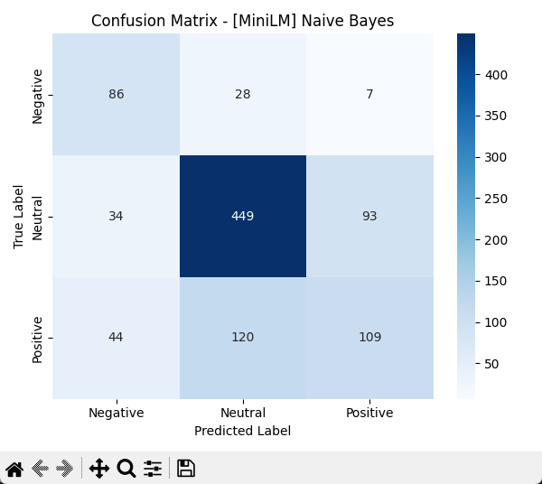 |

```
                     precision  recall  f1-score  support

Logistic Regression
  Negative (0)          0.62    0.83      0.71      121
  Neutral  (1)          0.87    0.76      0.81      576
  Positive (2)          0.64    0.71      0.67      273
  macro avg             0.71    0.77      0.73      970

Linear SVM
  Negative (0)          0.58    0.83      0.68      121
  Neutral  (1)          0.87    0.75      0.81      576
  Positive (2)          0.65    0.73      0.69      273
  macro avg             0.70    0.77      0.73      970

RBF SVM
  Negative (0)          0.74    0.74      0.74      121
  Neutral  (1)          0.80    0.89      0.85      576
  Positive (2)          0.77    0.59      0.67      273
  macro avg             0.77    0.74      0.75      970

Random Forest
  Negative (0)          0.78    0.57      0.66      121
  Neutral  (1)          0.72    0.98      0.83      576
  Positive (2)          0.89    0.32      0.47      273
  macro avg             0.80    0.62      0.65      970

Naive Bayes
  Negative (0)          0.52    0.71      0.60      121
  Neutral  (1)          0.75    0.78      0.77      576
  Positive (2)          0.52    0.40      0.45      273
  macro avg             0.60    0.63      0.61      970
```

## FinBERT — Classifier Results

| Classifier | Accuracy |
|---|---|
| Logistic Regression | 89.59% |
| Linear SVM | 87.63% |
| RBF SVM | 88.97% |
| **Random Forest** | **89.69%** |
| Naive Bayes | 88.66% |

| LR | Linear SVM |
|---|---|
|  |  |

| RBF SVM | Random Forest |
|---|---|
| 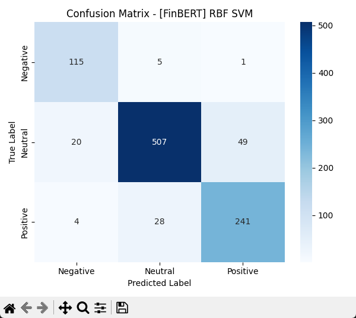 |  |

| Naive Bayes |
|---|
| 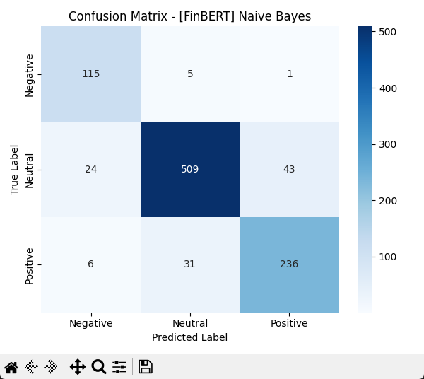 |

```
                     precision  recall  f1-score  support

Logistic Regression
  Negative (0)          0.85    0.93      0.89      121
  Neutral  (1)          0.93    0.90      0.92      576
  Positive (2)          0.85    0.87      0.86      273
  macro avg             0.88    0.90      0.89      970

Linear SVM
  Negative (0)          0.86    0.91      0.88      121
  Neutral  (1)          0.91    0.88      0.90      576
  Positive (2)          0.81    0.85      0.83      273
  macro avg             0.86    0.88      0.87      970

RBF SVM
  Negative (0)          0.83    0.95      0.88      121
  Neutral  (1)          0.94    0.88      0.91      576
  Positive (2)          0.83    0.88      0.85      273
  macro avg             0.86    0.90      0.88      970

Random Forest
  Negative (0)          0.84    0.93      0.88      121
  Neutral  (1)          0.93    0.91      0.92      576
  Positive (2)          0.86    0.86      0.86      273
  macro avg             0.88    0.90      0.89      970

Naive Bayes
  Negative (0)          0.79    0.95      0.86      121
  Neutral  (1)          0.93    0.88      0.91      576
  Positive (2)          0.84    0.86      0.85      273
  macro avg             0.86    0.90      0.88      970
```